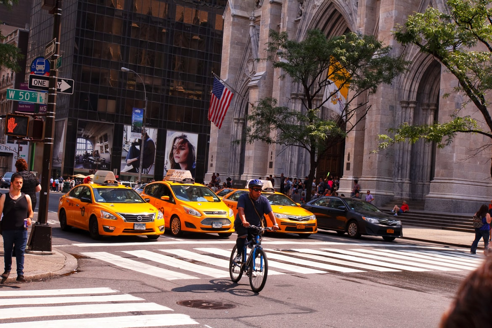
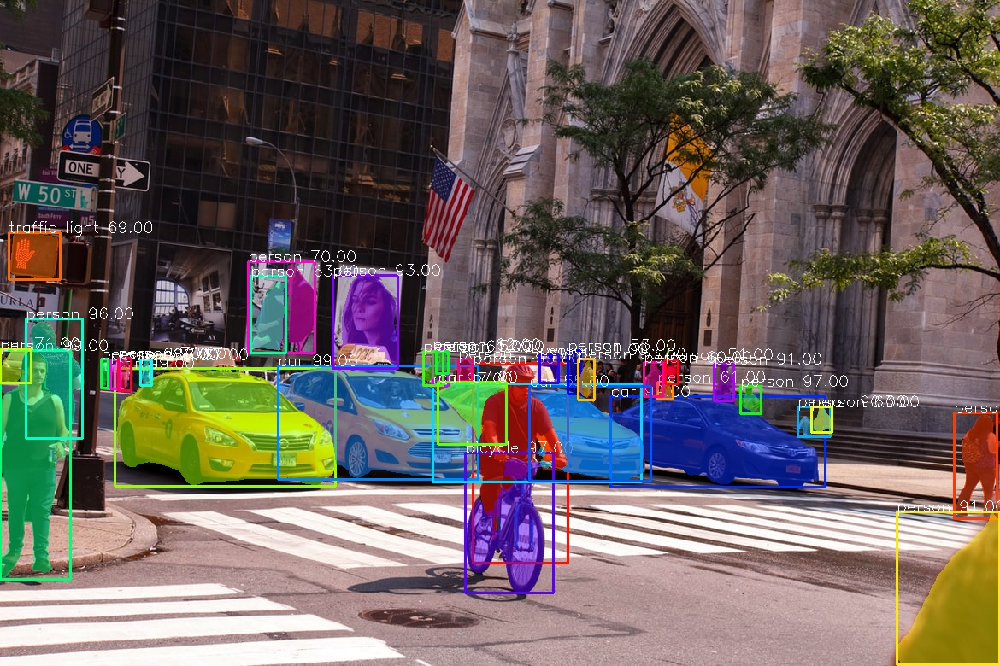
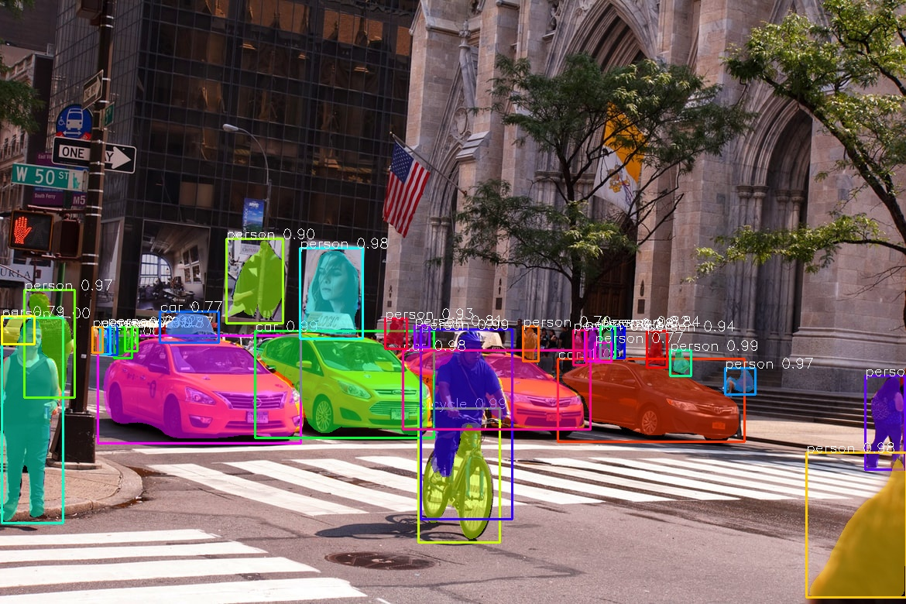

# instance-segmentation
### instance segmentation done using [PixelLib](https://github.com/ayoolaolafenwa/PixelLib)  
**Test Image**  
  
## Results  
**Using PointRend method**  
  
**Using Mask R-CNN model**  
(trained on coco dataset)  
  
